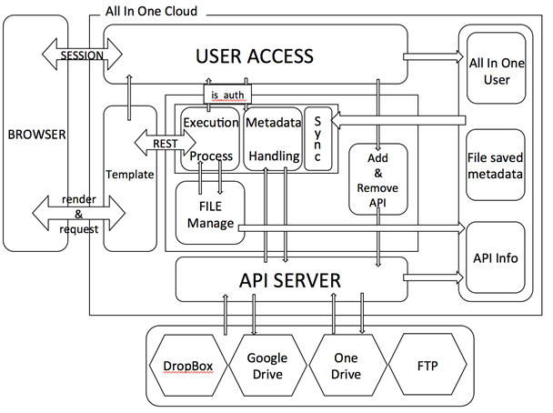

# AllinOne

Dropbox, Google Drive와 같은 여러 Cloud Service 계정 및 FTP서버 등을 하나의 계정으로 한 곳에 모아 관리하고 이에 더해 한 계정만으로 저장하기가 힘든 큰 용량의 자료를 분할 저장하여 
용량을 효율적으로 사용하는 플랫폼 구현 

엑세스포인트와 클라우드 데이터 센터와의 통신속도나 환경에 따라 좀 더 가까운 데이터 센터에 엑세스하여 파일 관리를 더 용이하게함


## Project Architechture


## Feature
* Account Management
  * create/delete service account
  * Add *Cloud Service Account* with OAuth
  * Reconstruct *Cloud Service Account* Credential in same format
* Manage File
  * upload/download
  * create/delete directory
  * modify/delete File 
  * searching File
  * Dirtectory Flow 
* File Distribute
  * File cut/merge as *ByteStream*
  * manage Distributed File with Dummy File
  * all metadata info save in Dummy File
* Support Cloud Service
 * Dropbox
 * Google Drive
 * One Drive
 * FTP
 
## Setting Virtual Environment

### Install packages in virtual environment
virtual environment activation (you must make your own virtual environments not mine)
```sh
. venv/bin/activate
```

(venv) has appear in front of command line and install require packages.
```sh
(venv)username@desktop$ pip install -r requirements.txt
```

### Developing with IDE
set this python file to interpreter
```sh
venv/bin/python
```

## Environment 
This Project Developed with Django Framework, Python2
